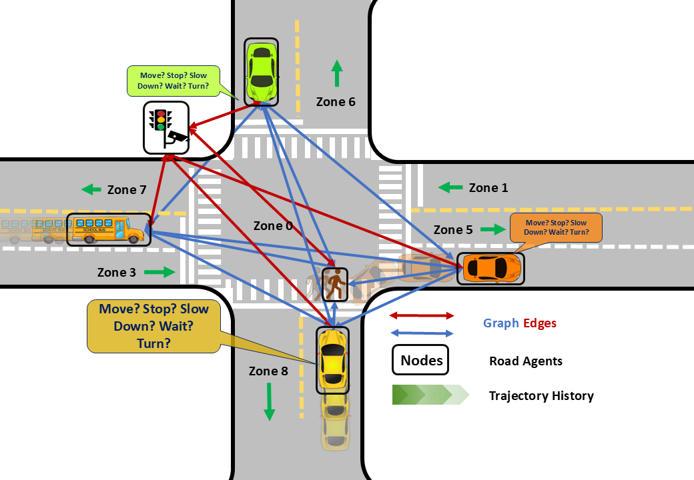
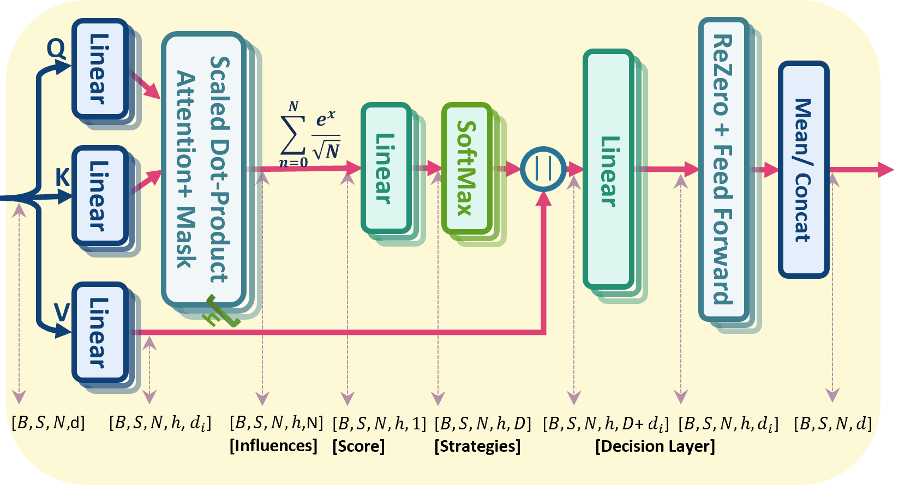
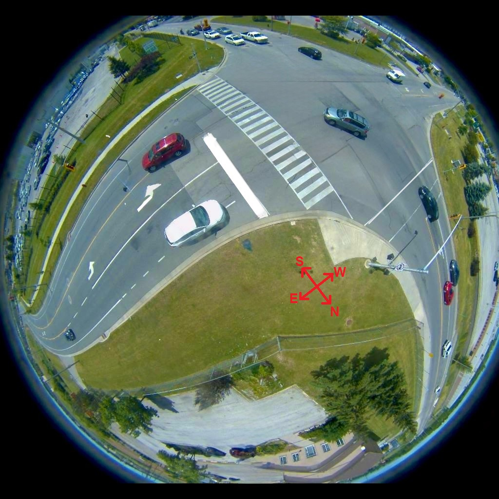
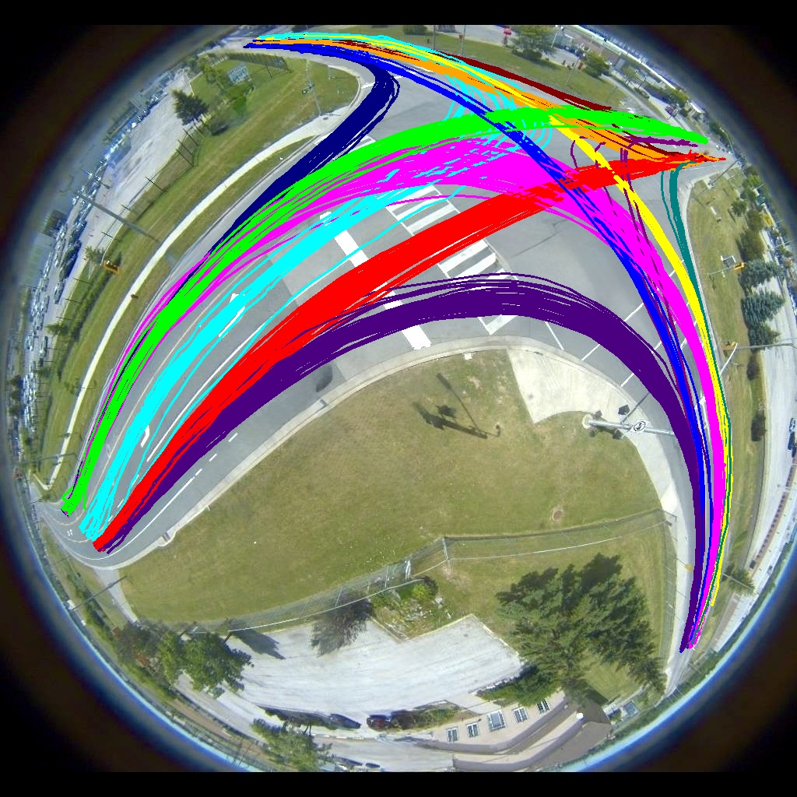

<figure style="text-align: center;">
  
</figure>

# HDAAGT #

Heterogeneous Decision-Aware Attention Graph Transformer for Scene-Centric Trajectory Predicton (HDAAGT): A non-autoregressive, encoder-only transformer model for vehicle trajectory prediction. HDAAGT integrates lane positioning, traffic light states, and vehicle kinematics, enabling a decision-aware graph attention mechanism that models agent-agent and agent-environment interactions. Decision-Aware Attention Graph(DAAG) network models the spatiotemporal influence of all neighboring road agents with and generates the decisions token for all road agents simultaneously.

<figure style="text-align: center; background-color: white;width: 300px; margin: auto; ">
  
  <figcaption style="font-style: italic; font-size: 14px; color: black;">Overview of the Decision-Aware Attention Graph Network.</figcaption>
</figure>

## Installation
Clone this repository with the following command:

  git clone https://github.com/abdibehzad96/HDAAGT.git

## Environment Setup

First, we'll create a conda environment to hold the dependencies

conda create --name hdaagt python=3.10 -y,  
source activate hdaagt,  
conda install --yes --file ./configs/requirements.txt,  

## Model Configuration

In the [configs/config.yaml](./configs/config.yaml) directory, you will find all the necessary parameters to train or test the model. Below is a breakdown of some key parameters to help you get started:

* **detection_path**: Specifies the path to the Fisheye-MARC CSV file.
* **generate_data**: [Bool] When set to `true`, prepares the Fisheye-MARC data for training/testing.
* **Zoneconf_path**: Path to the ZoneConf.yaml file used for dataset generation.

* **Load_Model**: [Bool] When set to `true`, loads a previously saved model.
* **Load_Model_Path**: Path to the previously saved model.
* **Train**: [Bool] When set to `true`, initiates training with the prepared data.
* **Test**: [Bool] When set to `true`, runs tests on the model using the prepared data.
* **Test_during_training**: [Bool] When set to `true`, tests the model every 5 epochs during training.
* **verbal**: [Bool] When set to `true`, prints the configuration parameters to the console.

## Model Training/Testing

After configuring the settings in the configuration file, you can run the model either by executing the `main.py` file directly or by running the following command in the terminal:

python main.py --config &lt;path to config.yaml&gt;

The best-trained model can be found in the [Pickled/best_trained_model.pth](./Pickled/best_trained_model.pth) directory.

# Fisheye-MARC dataset

The Fisheye-MARC dataset contains vehicle trajectory data collected from a fisheye camera installed at an intersection. The `Fisheye-MARC.csv` file includes the following columns:

- **Frame**: Frame number in the video sequence
- **ID**: Unique identifier for each vehicle
- **BBx**: X-coordinate of the bounding box
- **BBy**: Y-coordinate of the bounding box
- **W**: Width of the vehicle
- **L**: Length of the vehicle
- **Agent Type**: Type of agent (e.g., pedestrian, vehicle, truck, bus)
- **Traffic Light 1**: State of the traffic light of the Eastbound vehicles (Located at the West)
- **Traffic Light 2**: State of the traffic light of the Northbound vehicles (Located at the South)
- **Traffic Light 3**: State of the traffic light of the Westbound vehicles (Located at the Eastb)
- **Traffic Light 4**: State of the traffic light of the Southbound vehicles (Located at the North)
- **Zone**: Zone information for the vehicle

Traffic light states are represented as follows: 1 for green, 2 for yellow, 3 for red, 4 for a green left turn, and 5 for a yellow left turn.

<figure style="text-align: center; background-color: white;width: 370px; margin: auto; ">
  
  <figcaption style="font-style: italic; font-size: 14px; color: black;"> A scene recorded in the Fisheye-MARC dataset.</figcaption>
</figure>  
<figure style="text-align: center; background-color: white;width: 370px; margin: auto; ">
  
  <figcaption style="font-style: italic; font-size: 14px; color: black;"> All trajectories recorded in the Fisheye-MARC.</figcaption>
</figure>  

 

Number of trajectories recorded in the Fisheye-MARC:

| **Direction** | **Straight** | **Left Turn** | **Right Turn** |
|----------|----------|----------|----------|
| **East** | 77 | 17 | 45|
| **West** | 134 | 6 | 13 |
| **North** | 20 | 69 | 23 |
| **West** | 20 | 20 |80 |
| | | | |

