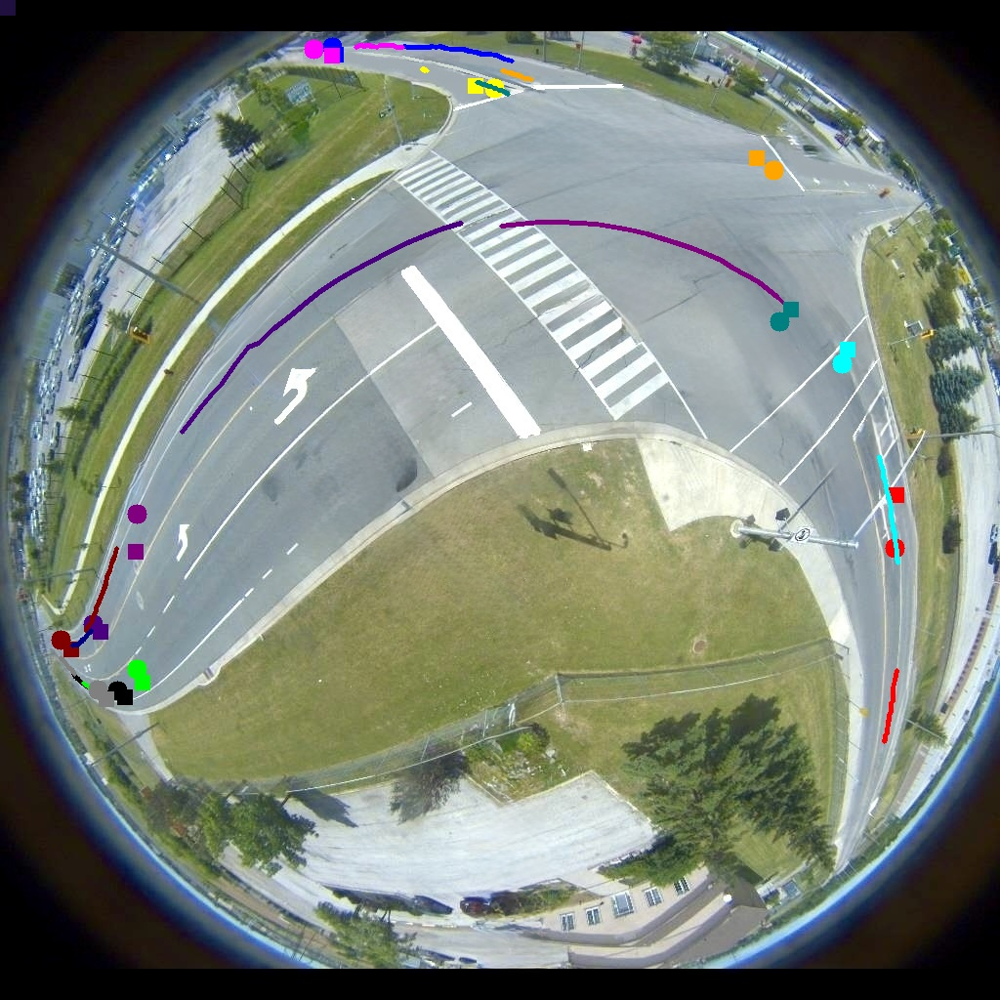

<p align="center"></p>

# HDAAGT #
<div style="text-align: justify;">
Heterogeneous Decision-Aware Attention Graph Transformer for Scene-Centric Trajectory Predicton (HDAAGT): A non-autoregressive, encoder-only transformer model for vehicle trajectory prediction. HDAAGT integrates lane positioning, traffic light states, and vehicle kinematics, enabling a decision-aware graph attention mechanism that models agent-agent and agent-environment interactions. Decision-Aware Attention Graph(DAAG) network models the spatiotemporal influence of all neighboring road agents with and generates the decisions token for all road agents simultaneously.
</div>
</br>

<p align="center"></p>

## Installation
Clone this repository with the following command:
```
git clone https://github.com/abdibehzad96/HDAAGT.git
```

## Environment Setup

First, we'll create a conda environment to hold the dependencies

```
conda env create -f config/requirements.yml
```

## Model Configuration
In the [configs/config.yaml](./configs/config.yaml) directory, you will find all the necessary parameters to train or test the model. Below is a breakdown of some key parameters to help you get started:

* **detection_path**: Specifies the path to the Fisheye-MARC CSV file.
* **generate_data**: [Bool] When set to `true`, prepares the Fisheye-MARC data for training/testing.
* **Zoneconf_path**: Path to the `ZoneConf.yaml` file used for dataset generation.

* **Load_Model**: [Bool] When set to `true`, loads a previously saved model.
* **Load_Model_Path**: Path to the previously saved model.
* **Train**: [Bool] When set to `true`, initiates training with the prepared data.
* **Test**: [Bool] When set to `true`, runs tests on the model using the prepared data.
* **Test_during_training**: [Bool] When set to `true`, tests the model every 5 epochs during training.
* **verbal**: [Bool] When set to `true`, prints the configuration parameters to the console.


## Model Training/Testing

After configuring the settings in the configuration file, you can run the model either by executing the `main.py` file directly or by running the following command in the terminal:

```
python main.py --config <path to config.yaml>
```
For both training and testing, the **Train** and **Test** values in the configuration file must be set. If both are enabled, testing will be performed at the end of the training session. Additionally, you can evaluate the model's performance on the test data during training by setting **Test_during_training** to `true`.

## Model Output
The expected output dimension of the model is **[B, SL, N, xy]**, where:  

- **B**: Batch size.  
- **SL**: Sequence length.  
- **N**: Number of agents on the road (up to `Nusers`).  
- **xy**: Predicted x and y coordinates. 

The image below illustrates the historical trajectories of road agents (represented as lines), along with their actual final positions (shown as circles) and predicted final positions (depicted as rectangles) after 3 seconds.
<p align="center"></p>

The best-trained model can be found in the [Pickled/best_trained_model.pth](./Pickled/best_trained_model.pth) directory.

[Watch Demo Video](./data/prediction.mp4)
# Fisheye-MARC dataset
The Fisheye-MARC dataset contains vehicle trajectory data collected from a fisheye camera installed at an intersection. The `Fisheye-MARC.csv` file includes the following columns:

- **Frame**: Frame number in the video sequence
- **ID**: Unique identifier for each vehicle
- **BBx**: X-coordinate of the bounding box
- **BBy**: Y-coordinate of the bounding box
- **W**: Width of the vehicle
- **L**: Length of the vehicle
- **Agent Type**: Type of agent (e.g., pedestrian, vehicle, truck, bus)
- **Traffic Light 1**: State of the traffic light of the Eastbound vehicles (Located at the West)
- **Traffic Light 2**: State of the traffic light of the Northbound vehicles (Located at the South)
- **Traffic Light 3**: State of the traffic light of the Westbound vehicles (Located at the Eastb)
- **Traffic Light 4**: State of the traffic light of the Southbound vehicles (Located at the North)
- **Zone**: Zone information for the vehicle


Traffic light states are represented as follows: 1 for green, 2 for yellow, 3 for red, 4 for a green left turn, and 5 for a yellow left turn.
<p align="center"></p>


Number of trajectories recorded in the Fisheye-MARC:

| **Direction** | **Straight** | **Left Turn** | **Right Turn** | **Total** |
|----------|----------|----------|----------|----------|
| **East** | 77 | 17 | 45| 139 |
| **West** | 134 | 6 | 13 | 153 |
| **North** | 20 | 69 | 23 | 112 |
| **West** | 20 | 20 |80 | 120 |
| **Total** | 252 | 113 | 91 | x |


Summary of information available on Fisheye-
MARC:

| **Fisheye-MARC** | **Value** |
|:----------|:----------|
| **Total tracks** | 456 |
| **Average tracks length** | 249.5 |
| **Frame rate** | 10 fps |
| **Time of the day** | 7-8 AM |
| **Camera height** | 9.5 m |
| **No. zones** | 9 |
| **Image resolution** | 1024*1024 |


## Dataset Preperation/Input Embedding

The code allows you to select specific columns for preprocessing and embedding. The `Columns_to_keep` parameter, defined as an array of column index numbers in the configuration file, determines which columns are used.  

Additionally, you must specify which indices within `Columns_to_keep` correspond to **Positional Embedding** using `xy_indx` and which ones correspond to **Traffic Embedding** using `Traffic_indx`.  

The following parameters configure the embedding layers:  

- **trf_embedding_dict_size**: Embedding dictionary size for `Traffic_indx`.  
- **trf_embedding_dim**: Embedding dimension for `Traffic_indx`.  
- **pos_embedding_dict_size**: Embedding dictionary size for `xy_indx`.  
- **pos_embedding_dim**: Embedding dimension for `xy_indx`.
